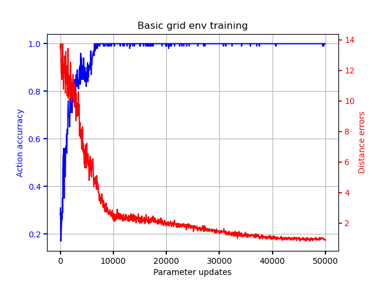
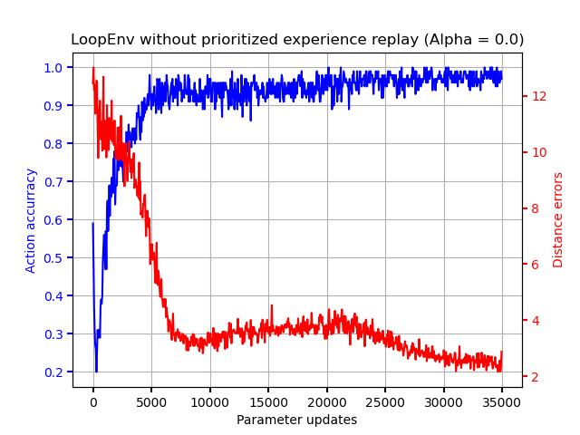
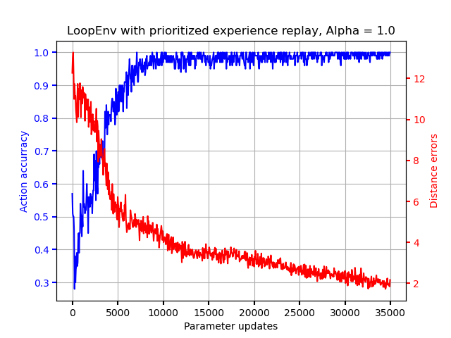
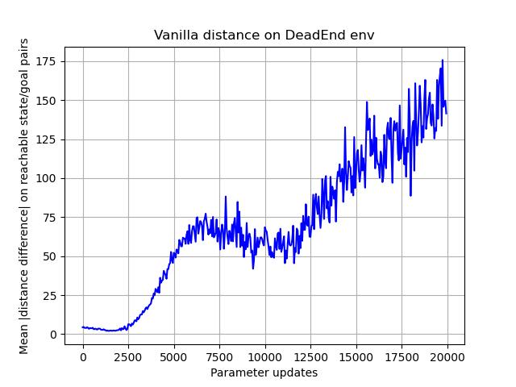
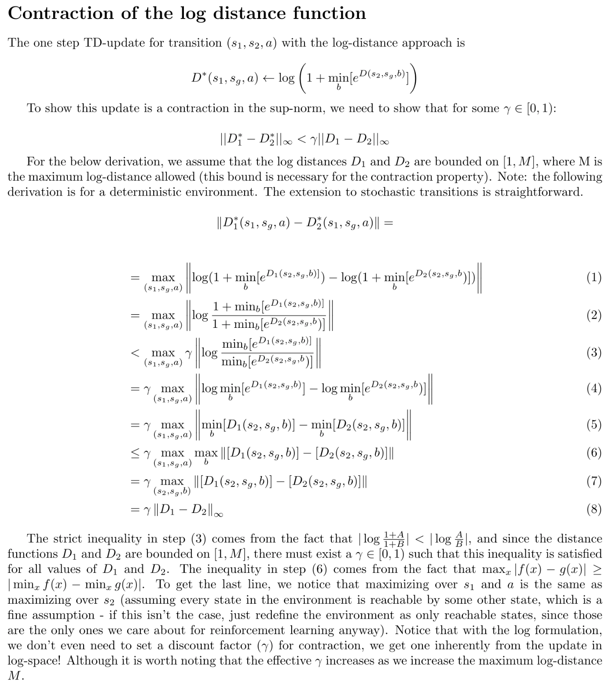
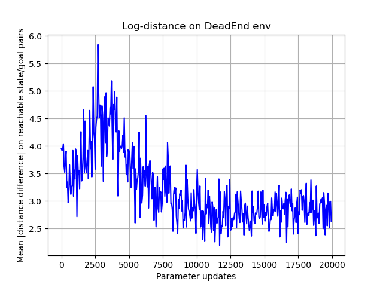

# Goal-directed reinforcement learning

The ultimate goal of this project is reinforcement learning
with goals (where a goalsetter sets a goal, and then the agent tries to achieve
that goal). The motivation for this is that goal-setting seems to me to be a better approximation
of how humans think than the main alternatives, which mostly fall into two broad categories - "reflex" 
learning, where a function approximator (i.e. neural network) learns how to map states to actions directly, 
and "tree search" methods, where a learned dynamics model is used to search the decision tree for
the best actions.  For example, Q-learning [3] and Agent57 [5] are examples of "reflex" learning, while
MuZero [4] is an example of "tree search" learning.

While humans certainly demonstrate both of these "reflex" and "tree search" capabilities, in my opinion, most higher-level
thought takes the form of goal-setting, goal-evaluating, and goal-pursuing. There are many other
examples of goal-oriented reinforcement learning ([1], [2]), but my approach here is
unique enough that I thought it worth exploring.

## Goal-pursuing

Goal-oriented AI requires two capabilities: a way to set goals (the goal setter), and a way to achieve
goals (the goal pursuer). In this project so far I have only focused on the goal pursuer. My initial
idea was that if asymmetric distance function could be learned between states, the goal pursuer could
be trained with intrinsic rewards for moving closer to the goal state. However, I soon realized that
a simpler approach could allow simultaneous learning of the distance function and the 
'actor' that moves from one state to another: if we represent the distance function
*D(s,g,a) => R*
as a function mapping current state *s*, goal state *g*, and action *a* to a distance, where 
*D(s,g,a) = (distance from s to g after taking action a)*,
then this function can be learned in a similar manner to standard Q-learning: for each transition *(s1,a -> s2)* with goal state *g*,
we can use the update

*D(s1,g,a) <= 1 + gamma * min b (D(s2, g, b))*

This is a contraction in the sup-norm, just like Q-learning. See section "Dead end toy environment" for a proof of the contraction
for the final version of this function (I modify it in that section). Of course, this being a contraction of the sup-norm
doesn't mean that it can be learned easily with a function approximator, but it's encouraging at least.

With this distance function learned, the goal pursuer can simply pick the action a that minimizes the predicted distance to the goal!
In practice I suspect things will be a little more complicated than this - if the action with minimum distance
is picked every time, then it's possible that "mistakes" in the learned distance function will lead to the goal
pursuer getting stuck in loops. This problem could potentially be solved by having the goal pursuer randomly sample
from actions according *D(s1,sk,a)* (so actions that lead to large distances would be less likely than those that lead to
small distances).

## Basic grid environment
To test the basic feasibility of this idea, I started with a simple 20x20 grid environment, where the state is
a pair of integer coordinates in 20x20 space, and the 5 actions 
correspond to moving in the cardinal directions, and waiting in place. Additionally, if the agent
tries to move off the edge of the grid, it remains in place. A great advantage of such a toy environment
is that the error of the learned distance function, and the accurracy of the actions it implies for a goal pursuer, 
can both be easily measured. The below figure shows the training curves of action accurracy and distance error 
for the 20x20 environment. Datapoints are single batches of size 1024 (I found high batch sizes to converge the fastest).

An obvious next step is to increase the size of the toy environment. In my experiments I have not yet been able
to reach 100% action accurracy in a toy environment above the size of about 40x40 (see discussion section).

## Uncommon transition toy environment (UTTE) and prioritized experience replay:
Clearly, the basic toy environment described above lacks many characteristics of more interesting environments.
One such characteristic is seldom-seen transitions. The UTTE is the same as the basic grid environment, with 
the exception that transitions off the bottom side of the grid bring the agent back around to the top.
Since the agent so far learns the distance function entirely through random actions, these transitions happen relatively
infrequently (the agent's random walk needs to bring it all the way across the grid). In my initial experiments,
I was not able to achieve 100% action accurracy on this environment. So, I added prioritized experience replay,
a common and successful technique to deal with this 'problem' of rarely-seen transitions. Below are the graphs
for the learned action accurracy with and without prioritized experience replay.

Note that the graph without experience replay may converge anyway if it were to keep training. Initially I was using 
a batch size of 128, and the LoopEnv wasn't converging without prioritized experience replay, but I found with a higher batch 
size of 1024 convergence happened much faster - so that's what these graphs show. In any case, prioritized experience replay
does converge faster than otherwise.

## Dead end toy environment (DETE):
My ultimate goal for this project was to train the agent in the Montezuma's Revenge Atari environment.
One important characteristic of this environment is that it has many "dead ends" - for example, when the
player jumps off a ledge, they are stuck in "dead end" until they hit the ground, die, and the game restarts.
To replicate this scenario, the DETE is a simple 1d line of 10 states, where each action transitions the
agent one state left, and when the agent reaches the last state, the environment is terminated. Hence,
the distance function must learn maximal distances for any (state, goal) pairs where the goal
happens before the state in this deterministic progression (the maximal distance is limited by the discount parameter,
for the vanilla distance approach).  

For my first attempt at training in such an environment, I just left the distance update the same, with
the additional modification that when an environment terminates, the distance target of the last
transition (with respect to any goal) is set to be the maximum value, *1/(1-gamma)*. However, this meant the
loss function way overemphasized errors at these larger distances, and the learned distance function
for the closer states diverged a lot. Below is a graph of the mean distance error for reachable (state, goal)
pairs (that is, it ingores state,goal pairs where the target distance would be the maximum value described above):

Clearly, accurracy at these distances is being sacrificed for better accurracy at the maximum distance.
In order to weight smaller distances higher in the loss function, I modified the distance update to take 
place in the log-distance space:

*D(s1,g,a) <= log (1 + min b exp(D(s2, g, b))*

Where now the *D(s1,g,a)* is learning a the log-distance between state *s1* and state *g* after taking action *a*.
This update is still a contraction in the sup-norm - see the below proof:

Link to pdf:
[proof of contraction of log-distance update](images/contraction_proof.pdf)

With this modification, the network does a much better job of learning small distances on the DeadEnd environment,
while still learning large distances for the unachievable states:

Note that the mean distance difference does not converge to 0. So, the model is not learning
the log-distance perfectly. Upon inspection of the actual values learned, the model seems to me
to be learning relative distances pretty well, especially with respect to each starting state,
but it systematically underestimates from the true distances. I suspect I will need to fine-tune
things more if it could every be used on a more complicated environment (see discussion section).

## Network and implementation details
The distance function is learned with a neural network approximator. On toy environments, states are represented by
tuples of integers *(x,y)*. The neural network learns an "encoding" of the state with two
fully connected layers, each with output size 128 and activation leaky relu. The 
distance between two states is taken by concatenating their two encodings, and passing
this through two fully connected layers, the first with output size 128, and
the second with output size *|A|* (the number of actions).  

The loss for the log distance function is computed as follows: for each transition
*(s1, s2, a)*, with goal state *sk*, the *Dab* loss is *(D(s1, s2, a))^2*, and
the *Dak* loss is *(D(s1, sk, a) - log (1 + min b e^D(s2, sk, b)))^2*. If 
*s1 -> s2* is a terminal transition, then the target *D(s2, sk, b)* is set to be
the maximum possible (I used 10). For prioritized replay, I used an alpha
value of 1.0 and a beta of 0.0 (since I'm working in deterministic environments
only so far, importance sampling is not required for prioritized replay). The 
*Dab* and *Dak* losses are combined to get *Loss = C * Dab + Dak*. I left *C = 1.0*
through all my experiments. I used an experience replay of size 2^18,
the Adam optimizer with learning rate 0.001, and batch size of 1024.  After filling
up the experience replay buffer, I trained with alternating steps of acting 
for 512 steps, and then training for 600 batches.

I did a bit of analysis with the tensorflow profiler, and the training is hard CPU-bound.
So, I added a bit of multiprocessing (6 workers converted sampled indices into the replay
buffer into a batch of data). This helps a little but could probably be optimized a lot more.

## Discussion
The major hurdle I'm facing at the moment is getting the model to learn larger
environments (it's stuck on the 40x40 basic toy environment). I've tried training
it on the Montezuma's Revenge deterministic Atari environment a few times, 
upgrading the encoding step to use CNNs instead of fully connected layers, and it
is able to learn some dead-end states, but distances are mostly meaningless otherwise.
I suspect that a major weakness of my approach is that it can only use the one-step 
TD-error to learn the distance function - most successfull deep reinforcement learning approaches that I'm aware of use 
n-step rollouts for the targets. 

References

[1] Universal Value Function Approximators, Schaul et al, 2015.
http://proceedings.mlr.press/v37/schaul15.pdf

[2] Hindsight Experience Replay, Andrychowicz et al, 2017.
https://arxiv.org/pdf/1707.01495.pdf

[3] Playing Atari with Deep Reinforcement Learning, Mnih et al, 2013.
https://www.cs.toronto.edu/~vmnih/docs/dqn.pdf

[4] Mastering Atari, Go, Chess, and Shogi by Planning with a Learned Model, Schrittwieser et al, 2019.
https://arxiv.org/pdf/1911.08265.pdf

[5] Agent57: Outperforming the Atari Human Benchmark, Badia et al, 2020.
https://arxiv.org/pdf/2003.13350v1.pdf

